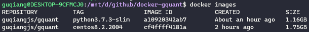

* `Dockerfile_python3.7.3-slim` 是基于 [python3.7.3-slim](https://hub.docker.com/layers/python/library/python/3.7.3-slim/images/sha256-8baf9805da02f00e4e668ae96850107903c7201cad0350380bbbbbf38846f293) 构建的适用于 gquant 分析的python环境。其中`python`版本为`3.7.3`.

  > 此版本是基于 `debian`的`stretch`版本构建。构建时会自动将`/etc/apt/sources.list`修改为[清华大学的开源镜像](https://mirrors.tuna.tsinghua.edu.cn/help/debian/)。

* ~~`Dockerfile_centos8.2.2004` 是基于 [centos8.2.2004](https://hub.docker.com/layers/centos/library/centos/centos8.2.2004/images/sha256-cf4f5cf174e78810379036c53fd6d258d13b3735aa5611b0b61e331a8fedbac6)构建的适用于 gquant 分析的python环境。其中`python`版本为`3.6.x`。~~

> *首次运行import QUANTAXIS后，会生成config.ini文件（其中包含mongodb所在位置，默认为localhost:27017）。可以通过`find / -name config.ini`命令查找。找到以后使用`vi /root/.quantaxis/setting/config.ini`命令进行修改。*
> 
> 也可以直接用 `sed -i 's/localhost/192.168.9.180/' /root/.quantaxis/setting/config.ini` 替换。